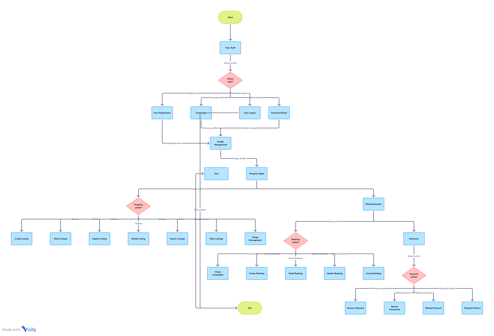

# features-and-functionalities

This directory contains the documentation outlining the key features and functionalities of the backend for the Airbnb Clone project.

## Contents

*  : A visual representation (diagram) created using Draw.io, detailing the backend features and their functionalities, including user authentication, property management, booking system, and payments.

## Purpose

This document serves to provide a clear and visual understanding of the backend requirements for the Airbnb Clone project. It aids in communication among team members and stakeholders, ensuring everyone has a shared understanding of the system's core functionalities.

## Steps to Create the Diagram (for reference)

1.  **Access Draw.io:** Open your web browser and navigate to [https://app.diagrams.net/](https://app.diagrams.net/).
2.  **Create a New Diagram:** Choose to create a new diagram. You can select a blank diagram or a template as a starting point if you find one suitable.
3.  **Identify Core Features:** Based on the project requirements (which you reviewed), identify the main functional areas of the backend (e.g., User Authentication, Property Management, Booking System, Payments). These will likely be the top-level elements in your diagram.
4.  **Detail Functionalities within Each Feature:** For each core feature, break down the specific functionalities it needs to support. For example:
    * **User Authentication:** Registration, Login, Logout, Password Reset, Profile Management.
    * **Property Management:** Create Listing, Read Listing, Update Listing, Delete Listing, Search Listings, Filter Listings.
    * **Booking System:** Check Availability, Create Booking, Read Booking, Update Booking, Cancel Booking.
    * **Payments:** Process Payment, Refund Payment, Payment History.
5.  **Choose Appropriate Shapes and Connectors:** Use the shapes available in Draw.io (e.g., rectangles for features/entities, ovals for processes) and connectors (arrows to show relationships and flow) to represent the backend structure and interactions.
6.  **Structure Your Diagram:** Organize the diagram logically. You might choose a hierarchical structure where main features are at the top, with their functionalities branching out. Alternatively, you could use swimlanes to represent different parts of the system.
7.  **Add Labels and Descriptions:** Clearly label each shape and connector. Add brief descriptions if necessary to explain the purpose or flow of a particular functionality.
8.  **Review and Refine:** Once you have an initial version, review it to ensure it accurately reflects the project requirements and is easy to understand. Make any necessary refinements.
9.  **Export as PNG:**
    * Go to **File** > **Export as** > **PNG...**
    * Configure the export settings as needed (e.g., ensure a reasonable zoom level for clarity).
    * Click **Export**.
    * Choose the `features-and-functionalities/` directory within your local clone of the `alx-airbnb-project-documentation` repository as the save location. Name the file `airbnb_backend_features.png`.
10. **Commit and Push:**
    * Open your terminal or Git client.
    * Navigate to your `alx-airbnb-project-documentation` repository.
    * Stage the changes: `git add features-and-functionalities/airbnb_backend_features.png`
    * Commit the changes: `git commit -m "Add diagram documenting backend features and functionalities"`
    * Push the changes to your GitHub repository: `git push origin main` (or `git push origin <your_branch_name>`)

This README provides context for the diagram, and the steps outline how you can create it using Draw.io and integrate it into your GitHub repository. Let me know if you have any specific questions as you work through this!