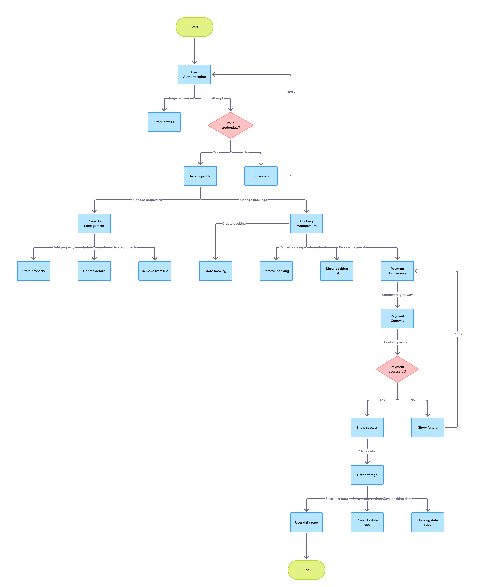

# DATA FLOW DIAGRAM

## Level 0 DFD (Context Diagram):

This will be a high-level overview showing the entire system as a single process and the external entities interacting with it.

#### External Entities:

- Guest
- Host
- Payment Gateway
- Process: Airbnb Clone Backend System

#### Data Flows:

- Guest provides Search Criteria to the System.
- System provides Property Listings to Guest.
- Guest provides Booking Request to the System.
- System sends Payment Information to Payment Gateway.
- Payment Gateway sends Payment Confirmation/Failure to System.
- System sends Booking Confirmation to Guest and Host.
- Host provides Property Details to the System.
- System provides Listing Confirmation to Host.
- Guest provides Profile Data to the System.
- Host provides Profile Data to the System.
## Level 1 DFD:

This will break down the "Airbnb Clone Backend System" process into its main sub-processes, showing the data flow between them and with the external entities.

#### Processes:

- User Authentication
- Property Management
- Booking Management
- Payment Processing
- Data Storage (Data Store)
#### Data Flows:

- From/To Guest/Host & Process 1 (User Authentication):

- Registration Data (Input)
- Login Credentials (Input)
- Authentication Status (Output)
- Profile Data (Input/Output)
#### From Host & Process 2 (Property Management):

- Property Details (Input)
- Listing Confirmation (Output)
- Property Updates (Input)
- Deletion Requests (Input)
#### From Guest & Process 2 (Property Management):

- Search Criteria (Input)
- Property Listings (Output)
- Property Details Request (Input)
- Specific Property Details (Output)
#### Between Process 2 (Property Management) & Process 3 (Booking Management):

##### Property Availability Information
###### From Guest & Process 3 (Booking Management):

- Booking Request (Input)
- Booking Updates (Input)
- Cancellation Request (Input)
###### To Guest & Process 3 (Booking Management):

- Availability Information (Output)
- Booking Confirmation (Output)
- Booking Details (Output)
- Cancellation Confirmation (Output)
#### Between Process 3 (Booking Management) & Process 4 (Payment Processing):

##### Booking Details for Payment
###### From Guest & Process 4 (Payment Processing):

- Payment Information (Input)
-To Payment Gateway & Process 4 (Payment Processing):

- Transaction Details
- From Payment Gateway & Process 4 (Payment Processing):

- Payment Status (Output)
- To Guest & Process 4 (Payment Processing):

- Payment Confirmation/Failure (Output)
#### Between all Processes & Process 5 (Data Storage):

- Data Read/Write operations for Users, Properties, Bookings, Payments, etc.
###### Data Stores:

- Users Data
- Properties Data
- Bookings Data
- Payments Data