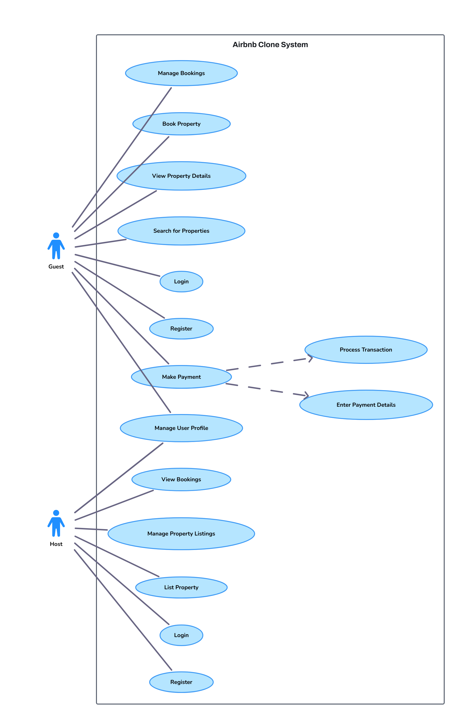

## USE CASE DIAGRAM

This diagram emphasizes the core functionalities from a user perspective, clarifying how guests and hosts interact with the platform for key actions like account management, property transactions, and booking processes. It provides a clear overview of the system's scope and the primary interactions between users and the applicatio

